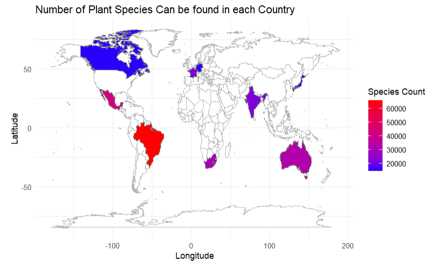
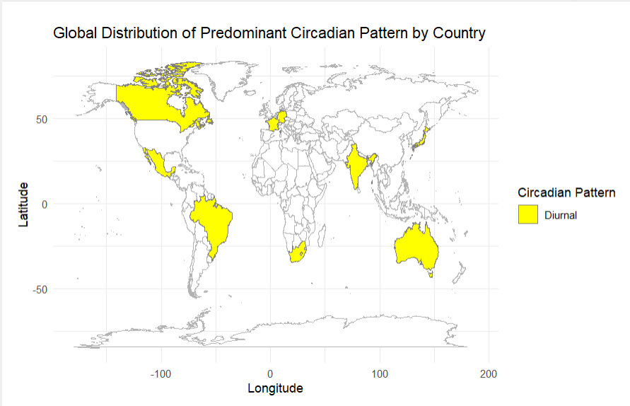

<!-- README.md is generated from README.Rmd. Please edit that file -->

```{r, include = FALSE}
knitr::opts_chunk$set(
  collapse = TRUE,
  comment = "#>",
  fig.path = "man/figures/README-",
  out.width = "100%"
)
```

# FloralCircadianR
Flowering Plants Circadian Rhythms Analysis and Visualization Toolkit

## Description

FloralCircadianR is an R package designed for analyzing and visualizing the circadian rhythms of flowering plants, including distribution, bloom times, closure times, and their interactions with pollinators.

It was built as an R package, and was developed as a part of a course project for [BCB410H1: Applied Bioinformatics](https://artsci.calendar.utoronto.ca/course/bcb410h1) during the Fall 2024 semester at the University of Toronto.

The `FloralCircadianR` package was developed using `R version 4.4.1 (2024-06-14)`, `Platform: x86_64-w64-mingw32/x64 (64-bit)` and `Running under: Microsoft Windows 11 23H2`.

## Installation

To install the latest development version of FloralCircadianR, run the following code in R:

```r
install.packages("devtools")
library("devtools")
devtools::install_github("AUR0RACY/FloralCircadianR", build_vignettes = TRUE)
library("FloralCircadianR")
```

## Overview

Provide the following commands, customized to your R package. Then provide a list of user accessible functions within the package and a brief description of each. Include one image illustrating the overview of the package that shows the inputs and outputs. Ensure the image is deposited in the correct location, as discussed in class. Point the user to vignettes for a tutorial of your package.

The overview for `FloralCircadianR` package:
```r
ls("package:FloralCircadianR")
data(package = "FloralCircadianR") 
browseVignettes("FloralCircadianR")
```

`FloralCircadianR` provides the following main functions for now:

- `plot_species_circadian_map()`: This function takes a data frame with country and circadian information, and plots it on a world map. Each country is colored based on diurnal/nocturnal patterns, with yellow indicating diurnal and blue indicating nocturnal.

- `plot_species_count_map()`: This function takes a data frame with country and species information, aggregates the species count per country, and plots it on a world map. Each country is colored based on the number of species found, with blue indicating fewer species and red indicating more species.

In addition, the helper functions for the two main functions are also provided:

- `find_country_circadian_pattern()`: This function calculates the predominant circadian pattern (diurnal or nocturnal) for each country based on the list of species found in each country and the circadian clock data for each species.

- `fetch_species_for_countries()`: This function retrieves all plant species for each country in the specified list using the BIEN database.

- `read_interested_countries()`: This function reads a CSV file containing a list of countries of interest.

- `read_plant_circadian_data()`: This function reads a CSV file containing plant species and their circadian clock properties.

## Example

```r
library(FloralCircadianR)

# Read in the circadian data of the plant you are interested, and the countries you are interested.

example_circadian <- read_plant_circadian_data("~/FloralCircadianR/data/test_circadian.csv")
example_country <- read_interested_countries("~/FloralCircadianR/data/test_country_list.csv")
# Fetch all the species that can be found in your interested country
all_species <- fetch_species_for_countries(example_country)

# You can plot the total number of species be found in every different country
plot_species_count_map(all_species)
```

```r

# You can find the predominant circadian pattern in each country
predominant <- find_country_circadian_pattern(all_species, example_circadian)

# You can also plot country's dominant circadian pattern
plot_species_circadian_map(predominant)
```



## Contributions

The author of the package is Yue Chen and wrote all functions in `FloralCircadianR`. This package provides functions for users to analyze the circadian patterns of flowering plants in interested countries, it plots the majority patterns (diurnal or nocturnal) of flowering plants in the certain countries into a map for visualization analysis.

Package `dplyr` was used across functions in `FloralCircadianR` for data manipulation.

Package `ggplot2` was used in functions `plot_species_circadian_map()` and `plot_species_count_map()` for generating the data-populated world map.

Package `BIEN` was used in function `fetch_species_for_countries()` for pull out the plant species in a certain country.

During the process of Development, ChatGPT was used to generate some sample test data and optimized some codes.

## References

- anjalisilva. (2019). GitHub - anjalisilva/TestingPackage: R Package Illustrating Components of an R package for BCB410H - Applied Bioinformatics (2019-2023), University of Toronto, Canada. GitHub. https://github.com/anjalisilva/TestingPackage

- OpenAI. (2024). ChatGPT. ChatGPT; OpenAI. https://chatgpt.com/

- R Core Team (2023). R: A language and environment for statistical computing. R Foundation for Statistical Computing, Vienna, Austria. https://www.R-project.org/

- RBIEN – Botanical Information and Ecology Network. (2024). Ucsb.edu. https://bien.nceas.ucsb.edu/bien/tools/rbien/

- Wickham, H. (2019). Create Elegant Data Visualisations Using the Grammar of Graphics. Tidyverse.org. https://ggplot2.tidyverse.org/

- Wickham, H., François, R., Henry, L., Müller, K., & Vaughan, D. (2019). A Grammar of Data Manipulation. Tidyverse.org. https://dplyr.tidyverse.org/

## Acknowledgements

This package was developed as part of an assessment for 2024 BCB410H: Applied Bioinformatics course at the University of Toronto, Toronto, CANADA. `FloralCircadianR` welcomes issues, enhancement requests, and other contributions. To submit an issue, use the [GitHub issues](https://github.com/AUR0RACY/FloralCircadianR/issues). Many thanks to those who provided feedback to improve this package.